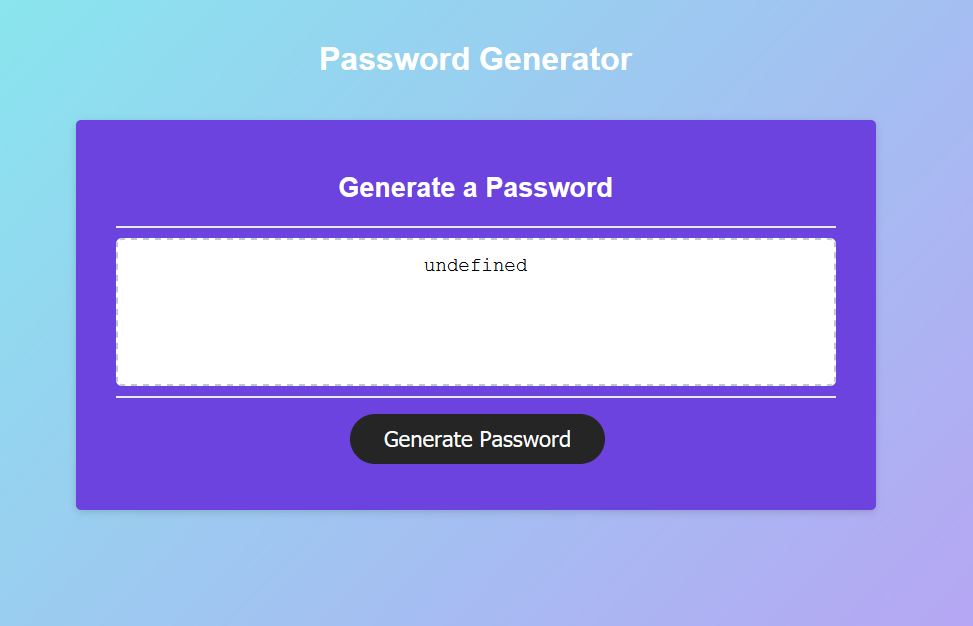
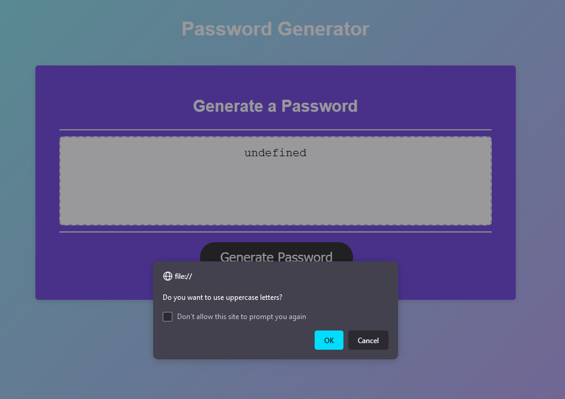
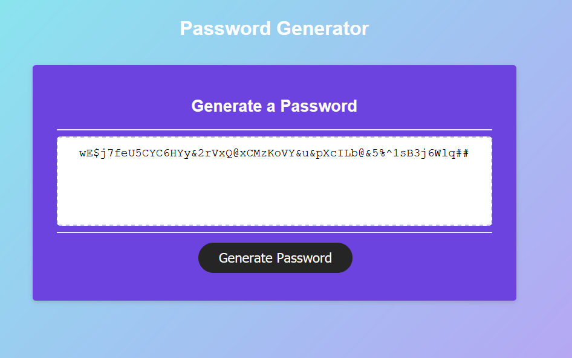

# ABOUT ASSIGNMENT

## RANDOM PASWORD GENERATOR

The purpose of this assignment is to use already existing code and add to it to create functions to write a randomly genreated password with criteria the client might need. 

Giving the client the options within prompts to add whatever they need in a user friendly way and finishing the prompts by writing the code either in an alert or on the page itself.

## DEMO OF PASSWORD GENERATOR

## CHECK OUT THE GENERATOR DEPLOYABLE BELOW

https://mattyjaws.github.io/Random-PW-Generator/